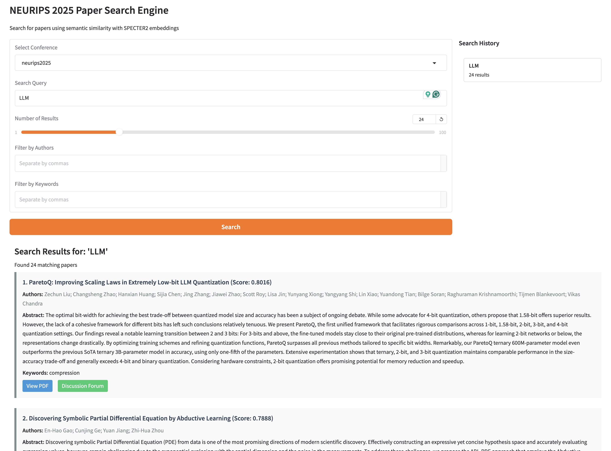

# OpenReview Paper Search

A tool for extracting and semantically searching papers from **any OpenReview-hosted conference** using SPECTER2 embeddings.

Supports all major ML/AI conferences including NeurIPS, ICML, ICLR, AISTATS, CVPR, ICCV, and more.
Indexes accepted papers using the OpenReview API v2 and runs a local web server on your laptop for interactive exploration.

**Developed by [Dan MacKinlay](https://danmackinlay.name) | [CSIRO](https://www.csiro.au/) (Commonwealth Scientific and Industrial Research Organisation)**




## Features

- **Multi-conference support**: Works with all major ML/AI conferences hosted on OpenReview (NeurIPS, ICML, ICLR etc.)
- Extract papers with full metadata from the OpenReview API
- Create semantic embeddings using SPECTER2 (specifically designed for academic papers)
- Build a robust search index with ChromaDB
- Search papers by semantic similarity, not just keywords
- Filter by authors and keywords (case-insensitive substring matching)
- Web interface with multi-venue switching and clickable search history
- Multiple output formats: plain text, CSV, JSON
- Command-line interface for batch processing
- Built-in API caching to reduce redundant requests

## Installation / Quickstart

1. [Make sure uv is installed](https://github.com/astral-sh/uv)

2. Clone this repository:
   ```bash
   git clone https://github.com/ynqiu/openreview_finder.git
   cd openreview_finder
   ```
3. Index papers for your desired conference (~10 minutes per conference, one-time setup)
   ```bash
   # Default: index NeurIPS 2025
   uv run openreview-finder index

   # Index other conferences using short name format
   uv run openreview-finder --venue icml2025 index
   uv run openreview-finder --venue iclr2026 index
   uv run openreview-finder --venue aistats2025 index

   # Or use full venue ID for custom conferences
   uv run openreview-finder --venue "NeurIPS.cc/2025/Conference" index
   ```
4. Launch web interface (supports all previously indexed conferences)
   ```bash
   uv run openreview-finder web
   ```

More options are available in the CLI help.

##  Examples

```bash
# Search NeurIPS 2025 (default)
uv run openreview-finder search "attention mechanism" --num-results 5

# Search ICML 2025
uv run openreview-finder --venue icml2025 search "reinforcement learning" --author "Yoshua Bengio"

# Filter by multiple authors and keywords
uv run openreview-finder search "graph neural networks" --author "Kaiming He" --keyword "self-supervised"

# Output in CSV/JSON format
uv run openreview-finder search "language models" --format json
uv run openreview-finder search "diffusion models" --format csv --output results.csv
```

### Example Output

```bash
$ uv run openreview-finder search "diffusion models for image generation" -n 3

╒═════╤═════════════════════════════════════════════════════════════════════════════════════════╤══════════════════════════════════════════════════════════════════╤═════════╕
│   # │ Title                                                                                   │ Authors                                                          │   Score │
╞═════╪═════════════════════════════════════════════════════════════════════════════════════════╪══════════════════════════════════════════════════════════════════╪═════════╡
│   1 │ Hierarchical Koopman Diffusion: Fast Generation with Interpretable Diffusion Trajectory │ ['Hanru Bai', 'Weiyang Ding', 'Difan Zou']                       │  0.8953 │
├─────┼─────────────────────────────────────────────────────────────────────────────────────────┼──────────────────────────────────────────────────────────────────┼─────────┤
│   2 │ Composition and Alignment of Diffusion Models using Constrained Learning                │ ['Shervin Khalafi', 'Ignacio Hounie', 'Dongsheng Ding', 'et al'] │  0.8851 │
├─────┼─────────────────────────────────────────────────────────────────────────────────────────┼──────────────────────────────────────────────────────────────────┼─────────┤
│   3 │ DiCo: Revitalizing ConvNets for Scalable and Efficient Diffusion Modeling               │ ['Yuang Ai', 'Qihang Fan', 'Xuefeng Hu', 'et al']                │  0.8816 │
╘═════╧═════════════════════════════════════════════════════════════════════════════════════════╧══════════════════════════════════════════════════════════════════╧═════════╛```
```

## Technical Details

### Conference Support

This tool uses the **OpenReview API v2** and supports all major ML/AI conferences:
- NeurIPS, ICML, ICLR, AISTATS, ML4H
- CVPR, ICCV, ECCV
- KDD, WWW, SIGIR, SIGMOD, ICASSP

**Venue format options**:
1. Short name format: `conference + year` (e.g. `neurips2025`, `icml2025`, `iclr2026`)
2. Full venue ID: Direct OpenReview venue identifier (e.g. `NeurIPS.cc/2025/Conference`)

- **Paper Selection**: Uses `get_all_notes(content={'venueid': venue_id})` to retrieve only accepted papers
- **Publication Status**: Automatically filters out submissions, withdrawn papers, and desk-rejected papers

### Web Interface Features
- Multi-venue selector to switch between all indexed conferences
- Clickable search history to quickly rerun previous queries
- Direct links to paper PDFs, OpenReview forums, and conference-specific pages
- Author and keyword filtering options

### SPECTER2 Embeddings

This tool uses the [SPECTER2 model](https://huggingface.co/allenai/specter2) from the [Allen Institute for AI](https://allenai.org/), which is specifically designed for scientific papers. It creates embeddings that capture the semantic meaning of academic text better than general-purpose embedding models.

The first time you run the indexing command, it will download the SPECTER2 model (about 440MB).

### Data Storage

- Paper embeddings and search index are stored per conference in `./chroma_db/<venue><year>/` (e.g. `./chroma_db/neurips2025/`, `./chroma_db/icml2025/`)
- API cache is stored in `./api_cache/` to reduce API calls across all conferences
- Logs are saved to `openreview_finder.log`
- Database size: ~107MB for ~5,000 papers with embeddings per conference

## Requirements

- Python 3.9+
- Dependencies include:

  - openreview-py
  - transformers/torch
  - chromadb
  - adapters
  - gradio

## Contributing

Contributions are welcome! Please feel free to submit a Pull Request.

## License

This project is licensed under the MIT License - see the LICENSE file for details.

## Acknowledgements

- [Allen Institute for AI](https://allenai.org/) for the SPECTER2 model
- [OpenReview](https://openreview.net/) for providing the API
- [CSIRO](https://www.csiro.au/) for supporting this work


